## I/O 学习笔记

> 所有测试代码均在 src/test/java/org/woodwhales/io 目录下
> 测试程序执行完毕之后，相应的文件目录位于：target/test-classes 目录下

## 基础概念

### Java输入/输出流体系中常用的流分类

注：

  斜体字标出的类代表抽象基类，无法直接创建实例
  粗体部分是节点流，其他就是常用的处理流。

| 流分类           | 使用分类                 | 字节输入流             | 字节输出流           | 字符输入流          | 字符输出流     |
| ---------------| -----------------------| ---------------------| -------------------| ------------------| -------------|
|                  | 抽象基类                 | *InputStream*          | *OutputStream*       | *Reader*            | *Writer*       |
| 节点流           | 访问文件                 | **FileInputStream**    | **FileOutStream**    | **FileReader**      | **FileWriter** |
| 访问数值         | **ByteArrayInputStream** | **ByteArrayOutStream** | **CharArrayReader**  | **CharArrayWriter** |                |
| 访问管道         | **PipedInputStream**     | **PipedOutStream**     | **PipedReader**      | **PipedWriter**     |                |
| 访问字符串       |                          |                        | **StringReader**     | **StringWriter**    |                |
| 处理流           | 缓冲流                   | BufferedInputStream    | BufferedOutputStream | BufferedReader      | BufferedWriter |
| 转换流           |                          |                        | InputStreamReader    | OutputStreamWriter  |                |
| 对象流           | ObjectInputStream        | ObjectOutputStream     |                      |                     |                |
| 抽象基类（过滤） | *FilterInputStream*      | *FilterOutputStream*   | *FilterReader*       | *FilterWriter*      |                |
| 打印流           |                          | PrintStream            |                      | PrintWriter         |                |
| 推回输入流       | PushbackInputStream      |                        | PushbackReader       |                     |                |
| 特殊流           | DataInputStream          | DataOutputStream       |                      |                     |                |

### InputStream

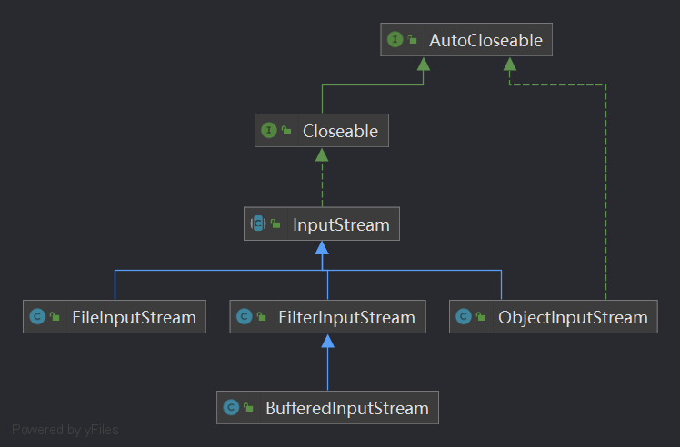

### OutputStream

### BufferedReader

该类有个 Reader 接口属性，可以包装 Reader 接口实现类

>   属于：包装流、处理流，只能操作非二进制的文本文件

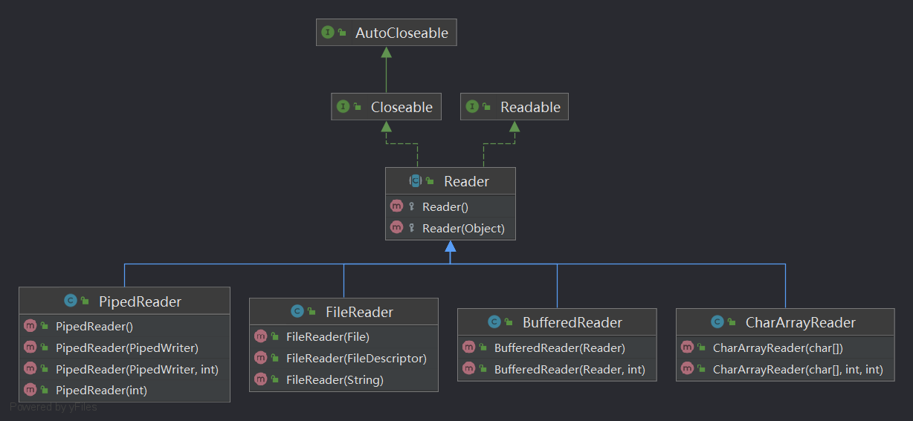

### BufferedWriter

该类有个 Writer 接口属性，可以包装 Writer 接口实现类

>   属于：包装流、处理流，只能操作非二进制的文本文件

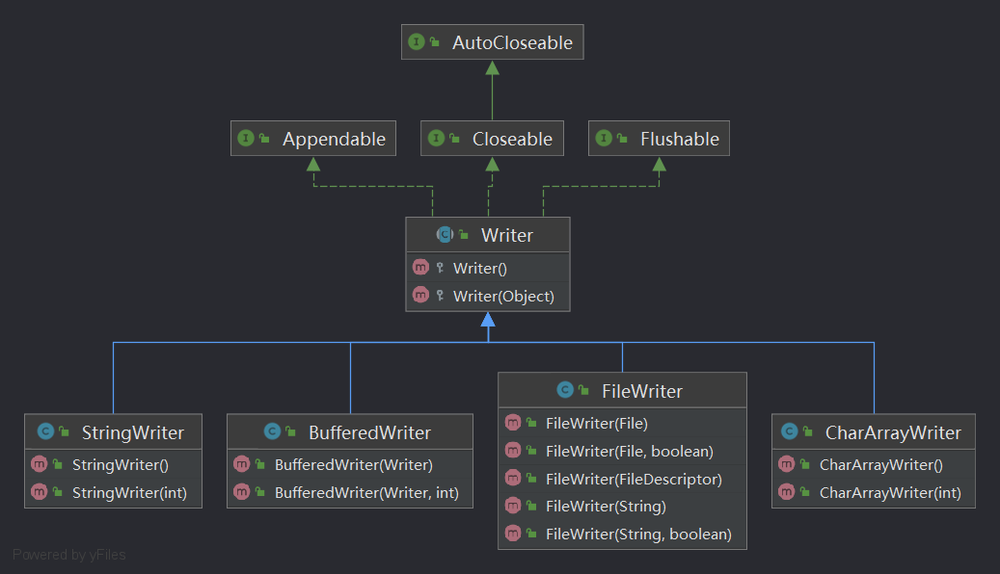

### BufferedOutputStream

该类的父类（FilterOutputStream）有个 OutputStream 接口属性，可以包装 OutputStream 接口实现类

>   属于：包装流、处理流，可以操作二进制文件，也可以操作文本文件（因为文本文件本质也是二进制文件）

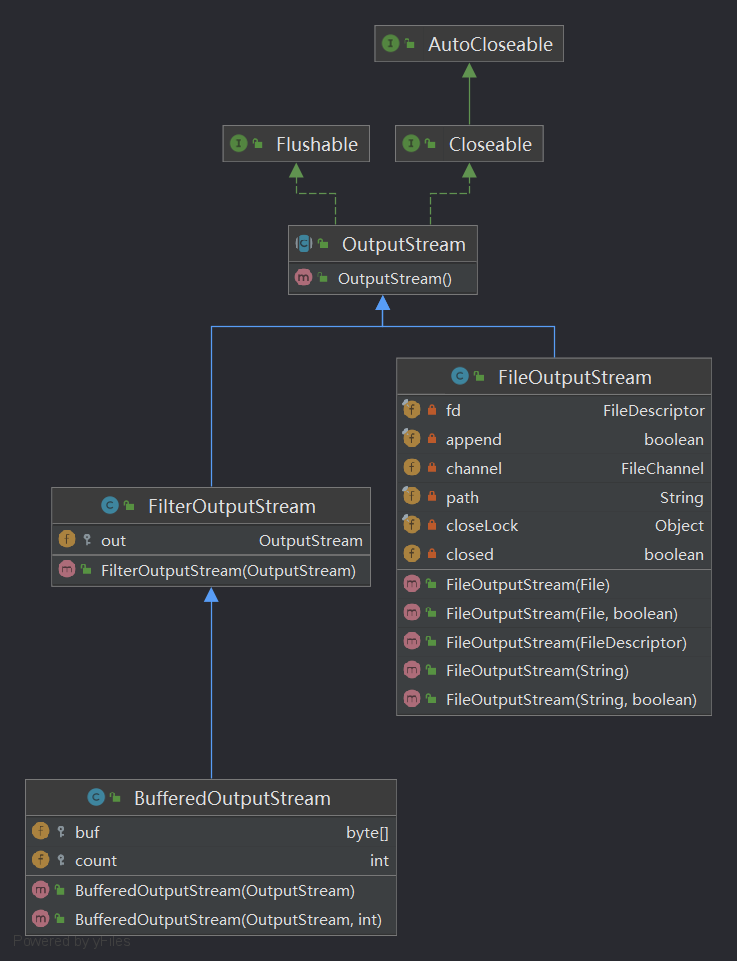

### BufferedInputStream

该类的父类（FilterInputStream）有个 InputStream 接口属性，可以包装 InputStream 接口实现类

>   属于：包装流、处理流，可以操作二进制文件，也可以操作文本文件（因为文本文件本质也是二进制文件）

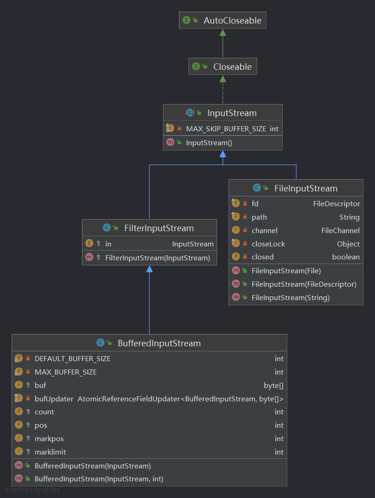

### ObjectOutputStream

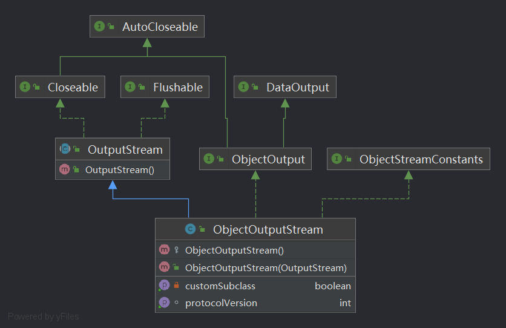

### ObjectInputStream

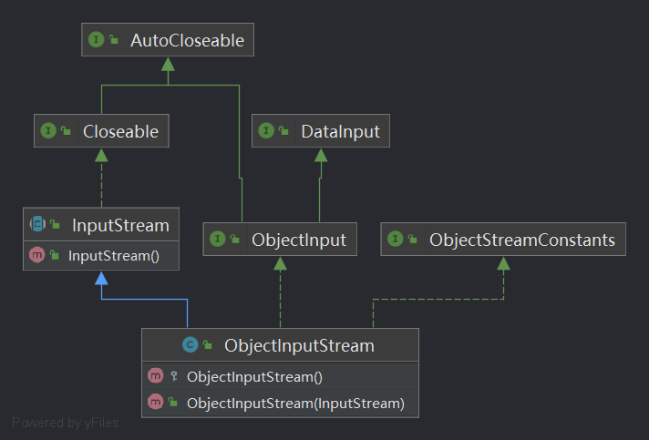

### 序列化和反序列化的注意事项

1、序列化时，只对对象的状态进行保存，而不管对象的方法；

2、当一个父类实现序列化，子类自动实现序列化，不需要显式实现Serializable接口；

3、当一个对象的实例变量引用其他对象，序列化该对象时也把引用对象进行序列化；

4、并非所有的对象都可以序列化，至于为什么不可以，有很多原因了，比如：

-   安全方面的原因，比如一个对象拥有private，public等field，对于一个要传输的对象，比如写到文件，或者进行RMI传输等等，在序列化进行传输的过程中，这个对象的private等域是不受保护的；

-   资源分配方面的原因，比如socket，thread类，如果可以序列化，进行传输或者保存，也无法对他们进行重新的资源分配，而且，也是没有必要这样实现；

5、声明为static和transient类型的成员数据不能被序列化。因为static代表类的状态，transient代表对象的临时数据。

6、序列化运行时使用一个称为 serialVersionUID 的版本号与每个可序列化类相关联，该序列号在反序列化过程中用于验证序列化对象的发送者和接收者是否为该对象加载了与序列化兼容的类。为它赋予明确的值。显式地定义serialVersionUID有两种用途：

-   在某些场合，希望类的不同版本对序列化兼容，因此需要确保类的不同版本具有相同的serialVersionUID；

-   在某些场合，不希望类的不同版本对序列化兼容，因此需要确保类的不同版本具有不同的serialVersionUID。

7、Java有很多基础类已经实现了serializable接口，比如String,Vector等。但是也有一些没有实现serializable接口的；

8、如果一个对象的成员变量是一个对象，那么这个对象的数据成员也会被保存！这是能用序列化解决深拷贝的重要原因；

### InputStreamReader

>   InputStreamReader **将字节流转换为字符流**。是字节流通向字符流的桥梁。

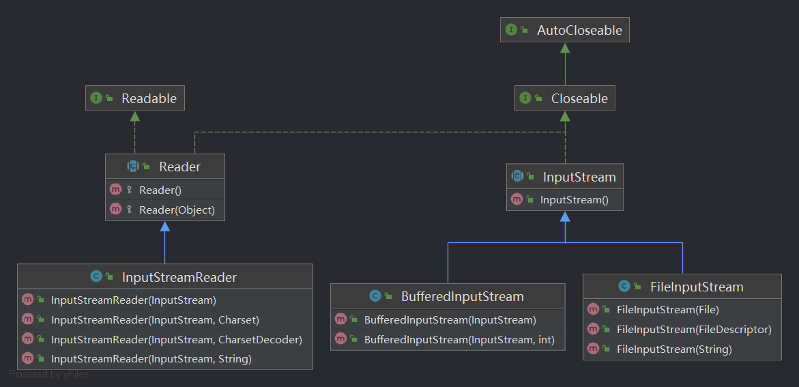

### OutputStreamWriter

>   OutputStreamWriter **将字符流转换为字节流**。是字符流通向字节流的桥梁。

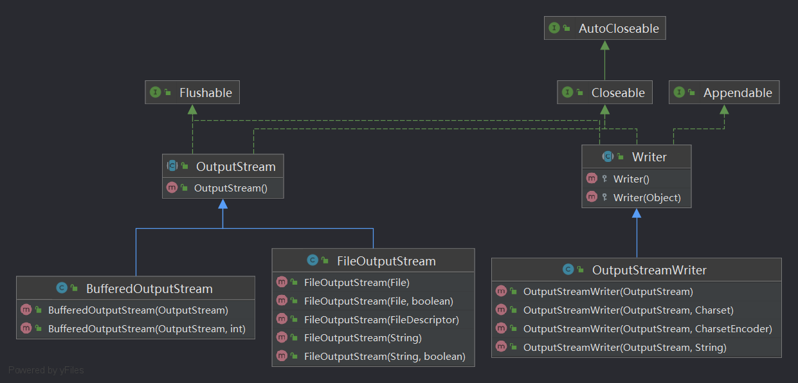

## 测试文件

### Demo1

创建文件的三种方式

### Demo2

File 对象的常用方法

### Demo3

FileInputStream

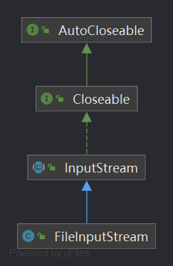

### Demo4

FileOutputStream

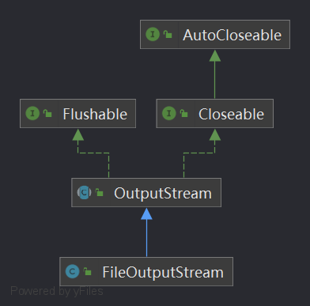

### Demo5

使用 FileInputStream 和 FileOutputStream 实现文件拷贝

### Demo6

FileReader

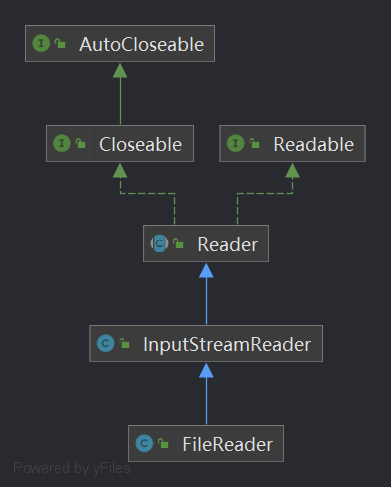

### Demo7

FileWriter

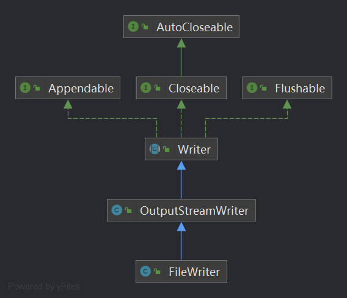

###   Demo8

java.io.BufferedReader 包装类

###   Demo9

java.io.BufferedWriter 包装类

###   Demo10

使用 BufferedReader 和 BufferedWriter 增强对 FileReader 和 FileWriter 使用，实现文件拷贝

###   Demo11

使用 BufferedInputStream 和 BufferedOutputStream 增强对 FileInputStream 和 FileOutputStream 使用，实现文件拷贝

### Demo12

使用 java.io.ObjectOutputStream 将数据序列化到文件中

### Demo13

使用 java.io.ObjectInputStream 将文件中的数据反序列化

### Demo14

使用 java.io.InputStreamReader 获取指定字符集的输入流

### Demo15

使用 java.io.OutputStreamWriter 输出指定字符集文本内容
